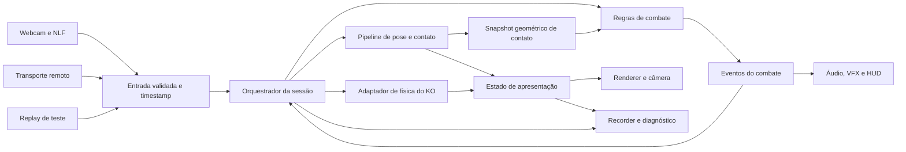

# Padrão de arquitetura e excelência — HEAVY HANDS

Decisão de projeto: 03/10/2026, solicitada pelo usuário. Status: **arquitetura-alvo e requisitos de aceitação; não descreve conformidade já alcançada**. Nenhuma reorganização do runtime foi executada nesta entrega.

O objetivo é permitir melhorar o jogo sem perder fidelidade ao gesto, criar correções concorrentes ou declarar qualidade sem evidência. Os [erros históricos](COLETANEA_PEDIDOS_ENTREGAS_E_ERROS_2026-10-03.md) são casos de regressão do padrão. A arquitetura serve ao jogo e ao desempenho, não à quantidade de classes, pastas ou padrões usados.

## 1. Arquitetura escolhida

**Monólito modular, organizado por capacidades do jogo, com núcleo de combate independente das bibliotecas, adaptadores explícitos e pipeline de animação por sistemas.** O serviço Python de inferência mantém uma fronteira própria com o cliente web.

Aplicar responsabilidade única e composição; usar conceitos de DDD para nomear regras e delimitar combate, rastreamento, apresentação e sessão. Não aplicar DDD completo com repositórios genéricos e entidades para cada vetor. Classes são adequadas a recursos com ciclo de vida, como sessão, renderer, rede e ragdoll; regras e operações matemáticas podem ser funções puras. Evitar hierarquias profundas de herança e um `GameManager` que conhece tudo.

Dois lutadores e sistemas existentes não justificam migrar todo o jogo para um framework ECS. A composição por componentes pequenos permite evolução futura se uma necessidade medida aparecer. Não exigir TypeScript como pré-condição de organização: contratos JSDoc e validações nas fronteiras servem para a adoção inicial; migração de linguagem exige decisão e benefício próprios.

Separar atualização e renderização é um princípio conhecido do game loop; a escolha concreta dos módulos abaixo é uma decisão para este projeto. [Game Loop, Robert Nystrom](https://gameprogrammingpatterns.com/game-loop.html), [Update Method](https://gameprogrammingpatterns.com/update-method.html).

O desenho mostra fluxo de dados. **Não autoriza imports circulares:** o orquestrador chama os módulos, recebe resultados e fornece as entradas da etapa seguinte. O núcleo de combate não chama renderer, NLF ou adaptadores.

## 2. Fronteiras e responsabilidades

| Módulo-alvo | Responsabilidade própria | O que não deve assumir |
|---|---|---|
| `domain/combat` | Golpes, defesa, força estimada, dano, HP, regras e estatísticas | DOM, mesh, webcam, Three.js, Cannon, sockets, som |
| `domain/match` | Round, resultado e transições válidas | Escolha de câmera, criação de materiais, reconexão |
| `runtime` | Montagem das dependências, ordem das etapas, clocks e ciclo da sessão | Fórmulas de dano, IK, shaders ou protocolo de rede |
| `input/tracking` | Receber NLF, validar/calibrar e produzir amostras canônicas | Aplicar dano, escrever osso renderizado, inventar passo como se fosse medido |
| `input/replay` | Entregar a mesma interface de entrada a partir de dados salvos | Solver ou lógica de combate alternativos para fazer testes passarem |
| `animation` | Retarget, reação, IK, guarda, punho, apoio; composição da pose | HP, transporte remoto ou codificação de vídeo |
| `physics` | Conversão de unidades/referenciais, corpos/juntas e estado de ragdoll | Regras de vencedor, UI ou alteração escondida do tracking |
| `contact` | Geometria de contato, varredura e dados de impacto | Misturar cálculo de contato, regra de dano e renderização |
| `presentation` | Renderer, câmera, arena, materiais, VFX e exibição do avatar | Mutar estado autoritativo do combate |
| `audio`, `ui` | Consumir estado/eventos e administrar recursos próprios | Detectar golpe ou decidir KO |
| `network` | Serialização, transporte, IDs/ACK e sincronização | Confiar em pacote externo sem validar, escrever ossos por fora do pipeline |
| `diagnostics` | Métricas, snapshots, recorder e relatórios | Mudar física para obter um resultado visual favorável |
| Serviço Python de inferência | Detector/crop, backend, concorrência e resposta com metadados | Adotar regras do jogo dentro do modelo de reconhecimento |

Estrutura indicativa: `viewer/game/<módulos acima>`, `scripts/` para ferramentas reproduzíveis, `tests/` para verificações, `docs/` para decisões e `experiments/` para resultados. Não mover arquivos só para parecer organizado. As ferramentas de treino e análise de `src/pose_lab` mantêm sua função própria; a migração do cliente não deve misturá-las ao runtime do jogo.

## 3. Requisitos de estrutura e dependências

**A01 — Núcleo independente.** Cálculo de dano, classificação e estatísticas executáveis sem navegador, Three.js ou Cannon. Verificação: testes importam apenas os módulos de domínio e entradas numéricas.

**A02 — Estado com dono definido.** Cada estado mutável tem um módulo responsável e uma lista explícita de leitores/escritores. HP pertence ao combate; transição de KO à partida; pose composta à animação; corpo físico ao adaptador; conexão à rede. Verificação: nenhuma escrita externa fora do contrato documentado.

**A03 — Dependências sem ciclos.** Adaptadores podem depender dos contratos do núcleo; o núcleo não depende deles. A aplicação monta dependências explícitas. Não usar service locator global para esconder imports. Verificação: mapa de imports e teste automatizado de fronteiras quando a primeira extração ocorrer.

**A04 — Orquestração enxuta.** O ponto de entrada inicializa módulos e agenda etapas. Regras, fórmulas, UI e shaders ficam nos módulos responsáveis. Não criar dezenas de arquivos triviais: dividir quando houver motivo distinto para mudar, dependência diferente ou teste independente. Tamanho de arquivo é sinal de revisão, não métrica isolada de qualidade.

**A05 — Contratos versionados.** Documentar formatos de `TrackingSample`, `ContactSnapshot`, `ImpactEvent`, `MatchState`, `PresentationState` e `RecordingManifest`, com unidades, referencial, tempo e campos opcionais. Validar dados externos uma vez na fronteira e invariantes internas em desenvolvimento.

**A06 — Decisões curtas e rastreáveis.** Registrar decisão arquitetural com problema, escolha, alternativas, consequências e critério de revisão. Preferências de potência/visual são configuração do jogo, não fatos matemáticos. Não duplicar a mesma constante em teste, documento e código sem ligação à configuração versionada.

## 4. Tempo, atualização e estados

**T01 — Relógios explícitos.** Distinguir captura, chegada, simulação e apresentação; documentar como pausa, hit-stop e câmera lenta afetam cada um. Funções recebem tempo/delta por parâmetro. Leitura de `performance.now()` fica nas fronteiras, não espalhada pelas regras de reação.

**T02 — Física com passo fixo.** Manter um responsável pelo acumulador e pelo passo da física, com limite de recuperação sob carga e política registrada para o tempo excedente. A taxa de renderização não determina a potência/gravidade. A técnica de acumulador com interpolação ajuda a separar as taxas; não garante determinismo entre máquinas. [Fix Your Timestep!, Glenn Fiedler](https://www.gafferongames.com/post/fix_your_timestep/).

**T03 — Replay pelo caminho de produção.** Entrada gravada usa o mesmo contrato, scheduler e sistemas da entrada ao vivo. Reprodução usa seed e relógio controlados, versões e tolerâncias. Um ensaio que pula hit-stop, câmera ou detector deve declarar esse recorte e não ser chamado de reprodução completa.

**T04 — Máquina de estados.** Estados e transições legais de lobby, calibração, luta, pausa, KO, resultado e reset explícitos; transição executada uma vez. KO e perda de tracking não são booleans contraditórios espalhados. Verificação: transições inválidas, repetição de KO, reset em gravação e desconexão durante resultado.

**T05 — Ordem causal do contato.** A entrada é amostrada, a pose relevante é resolvida, as matrizes são atualizadas e o contato é calculado com snapshots carimbados. Reações são aplicadas na etapa declarada. Se uma etapa usa geometria do tick anterior, registrar esse atraso deliberadamente. Não depender de uma chamada ao renderer para atualizar matrizes necessárias ao combate.

## 5. Pose, física e fidelidade

**P01 — Um compositor final.** Sistemas calculam alvos/deltas/restrições numa sequência declarada; o compositor decide o resultado. Se um passe precisa escrever temporariamente no rig para medir geometria, seu efeito é explícito e limitado. Não existe writer escondido em câmera, HUD ou áudio.

**P02 — Autoridade por modo.** Em luta, tracking e correções compõem a pose; em KO, a vítima passa ao ragdoll. A transição captura pose e condições iniciais coerentes; reset restaura rig/filtros e descarta corpos. Não permitir retarget e Cannon disputarem o mesmo osso no mesmo modo.

**P03 — Correções com contrato próprio.** Para cada IK/filtro/limite: indicar motivo, ossos afetados, referência de entrada, prazo e modo de ativação/liberação. Uma função posterior não desfaz silenciosamente a anterior. Passes iterativos de contato podem ser válidos, com convergência e custo medidos.

**P04 — Convenções físicas documentadas.** Metros, segundos, kg, radianos, m/s, rad/s, N e N·s identificados. Distinguir ponto absoluto, direção e deslocamento relativo. Conferir API da versão instalada; incluir teste de impulso central e do mesmo impacto transladado no ringue. Não converter número de câmera em “força real medida”.

**P05 — Referenciais do rig.** Cada avatar tem perfil de repouso, escala, eixos, comprimentos e volumes. A conversão esquerda/direita, espelhamento e coordenadas câmera/mundo/local é centralizada; conversões nomeadas. Testar subida dos braços, pronação, mudança a 90°, antiparalelos e mudança de escala.

**P06 — Dado ausente não é gesto inventado.** Guardar confiança/origem da amostra. Fallback local e temporário preserva informação válida de outros membros; movimento estimado é identificado. Ausência de um pé não apaga automaticamente o joelho visível do outro. Limitações do modelo são separadas de defeitos do adaptador.

**P07 — Contato separado de dano.** Detecção produz região, ponto, normal/direção e identidade temporal do contato; combate decide dano; animação decide reação. Distinguir autodetecção da guarda e contato com o adversário. Classificar um acerto não comprova que as malhas não atravessam.

**P08 — Torção medida corretamente.** Medir swing/twist relativo no referencial das juntas, incluindo ±180° e pose inicial. Erro de âncora, quaternion finito e limite configurado não substituem essa medição. Rigidez de solver não é músculo; cortes de velocidade são modelagem explícita, com efeitos observados.

**P09 — Chão com responsabilidade exclusiva.** Definir quem coloca a raiz no piso, quem controla sua altura e o significado de levantar um pé/saltar. Monitorar offsets internos e deriva longa; proibir dois planters que se compensam sem contrato. Não perder movimentos legítimos para manter a sola sempre no chão.

**P10 — Fidelidade e estética avaliadas separadamente.** Quanto o avatar segue o sinal, quanto o sinal segue a pessoa e quanto o movimento agrada são perguntas diferentes. Um lançamento forte aprovado pelo usuário permanece referência estética, mesmo ao corrigir o mecanismo de torque.

## 6. Eventos, rede e efeitos

**N01 — Evento de combate único.** Um impacto confirmado tem ID, tick, origem, alvo e dados necessários. Dano, áudio, VFX, estatística e recorder consomem esse fato. Não detectar o mesmo golpe separadamente no som e no HUD. Ordem de entrega e efeitos que dependem dela ficam explícitos; eventos não servem para ocultar o fluxo.

**N02 — Autoridade online documentada.** Declarar quem valida tentativa, contato, dano e resultado em relay/P2P. O transporte não cria uma segunda regra de combate. Tratar duplicata, atraso, perda, reordenação e reconexão; IDs idempotentes e versões de protocolo. Não prometer segurança competitiva sem modelo de confiança próprio.

**N03 — Visual remoto separado do resultado.** Interpolação/extrapolação melhora apresentação; não inventa dano nem altera silenciosamente histórico autoritativo. Testar adversário parado, pacote atrasado, KO com perda de histórico e recuperação.

**N04 — Efeitos sem poder sobre o combate.** VFX/áudio/câmera consomem eventos e snapshot de apresentação. Qualidade baixa pode reduzir partículas/resolução; não mudar alcance, dano ou detecção para aumentar FPS.

## 7. Recursos e desempenho

**R01 — Ciclo de vida completo.** Módulo que cria recurso oferece cancelamento/reset/descarte conforme necessário: listener, RAF/timer, socket, track da câmera, nó de áudio, worker, corpo físico, material, textura e buffer. Garantir repetição segura de entrar/sair/trocar avatar. Recurso compartilhado exige regra de ownership para não ser descartado enquanto outro consumidor o usa.

Three.js exige descarte explícito de recursos GPU; remover objeto da cena não libera automaticamente geometria, material e textura. Essa exigência fundamenta os testes de ciclo de vida. [Cleanup — documentação Three.js](https://threejs.org/manual/pages/cleanup.html).

**R02 — Trabalho limitado.** Pools de efeitos, frames em voo, filas de poses/rede e escrita do recorder têm limites e política de descarte/pressão. Diagnóstico não pode acumular memória indefinidamente. Escolher a pose recente não autoriza descartar eventos importantes do combate.

**R03 — Caminho frequente simples.** Evitar alocação, DOM, leitura de vértices e reconstrução de metadados repetidos no frame sem necessidade. Usar caches invalidados por eventos reais; medir antes de acrescentar complexidade. Imutabilidade é de contrato: não exige copiar todos os ossos e vetores a cada substep.

**R04 — Orçamentos verificáveis.** Registrar perfil gráfico, hardware, resolução, navegador, avatar, carga NLF e cenário. Meta inicial de referência: apresentação a 60 Hz, orçamento total de 16,67 ms por quadro; definir também modo econômico a 30 Hz/33,33 ms quando adequado. São objetivos a validar, não desempenho garantido nem limite automático para cada subsistema.

**R05 — Performance ponta a ponta.** Medir p50/p95/p99 de intervalos, idade da pose, poses únicas/s, perdas, memória e carregamento; tempo de `renderer.render()` na CPU não é tempo GPU. Comparação A/B alternada e sessão longa; não chamar teto de 60 FPS de capacidade máxima medida.

**R06 — Otimização preserva contrato.** LOD, compressão, cache, WebGPU e troca de backend exigem teste de contato/pose/visual além de custo. Não migrar engine por promessa genérica. Dados de asset podem mudar volumes e rig; validar separadamente qualidade e gameplay.

## 8. Testes e evidência de excelência

**Q01 — Testes que distinguem causas.** Unidade para matemática/regras; integração para ordem e fronteiras; browser para recursos/render/entrada; replay e vídeo para movimento. Testar propriedade relevante, não apenas repetir o cálculo implementado. Exemplo: chão verifica raiz/modelo além de sola; transferência de impacto compara com controle sem impulso, mesma gravidade e mesma pose, medindo a componente na direção do golpe.

**Q02 — Corpus visual obrigatório para alterações de movimento.** Guardas, mãos juntas, braços elevados, twist/punhos, jab/direto/gancho, bloqueio/liberação, reações repetidas, KO em posições/direções variadas. Mesmo input, avatar, potência, clocks e câmeras antes/depois. Entregar vídeos abríveis e pontos de atenção; um print não aprova naturalidade.

**Q03 — Manifesto da execução.** Versão/hash do código e fixtures, avatar/asset, seed, parâmetros físicos, backend, clocks, FPS de captura, erros e limites do replay. Comparação incompatível é identificada. Não comparar vídeos com inputs distintos e chamar a diferença de efeito da correção.

**Q04 — Gates proporcionais.** Mudança matemática executa seus casos; mudança no scheduler executa tempo/pausa/replay; movimento executa corpus relevante; rede executa perda/ordem/duplicata; recurso executa ciclo de vida; performance executa carga representativa. Suite completa nas entregas que afetam vários sistemas. Alteração somente documental verifica conteúdo/links, sem testes físicos irrelevantes.

**Q05 — Instrumentação com custo declarado.** Debug é opt-in e lê snapshots. Medir overhead; recorder visual e logger físico têm taxas diferentes. Não prometer “todos os dados” sem enumerar campos/frequências. Decisão visual não fica escondida em um número agregado.

**Q06 — Aceitação honesta.** Estado de requisito: cumprido com evidência, parcial, não validado, pendente ou substituído. Nota alta não compensa defeito crítico aberto. Não declarar naturalidade, precisão humana, ganho universal ou conservação física por um teste que mede outra coisa.

## 9. Código, configuração e entrega

**C01 — Nome expressa contrato.** Nomes distinguem `worldHitPoint`, `relativeHitOffset`, `impulseNs`, `simulationTimeS`, `capturedAtMs`; eliminar unidades ambíguas e números mágicos. Comentários explicam restrição, hipótese e decisão; comentário desatualizado é corrigido junto do comportamento.

**C02 — Configuração única e versionada.** Parâmetros de combate, junta e perfil por avatar têm origem identificável, validada e registrada no manifesto. Evitar módulos `utils`/`helpers` genéricos como depósito. Configuração local do usuário não é reescrita silenciosamente.

**C03 — Ferramentas reproduzíveis.** Versões de dependências fixadas nos arquivos apropriados; comandos de teste/documentação disponíveis; scripts com argumentos, códigos de saída e saídas previsíveis. Artefatos antigos são preservados por versão; cache não substitui execução nova quando a pergunta exige inferência nova.

**C04 — Diff pequeno e reversível.** Extração estrutural separada de mudança de comportamento sempre que possível. Não fazer migração global para resolver um punho. Não deixar implementação velha e nova competindo; migração tem etapa e condição explícita de retirada.

**C05 — Falha tratada no dono correto.** Erro de asset, queda de tracker, câmera indisponível e socket perdido têm política de recuperação e mensagem própria. Não usar `catch` vazio para converter erro em sucesso. Logs não devem expor vídeo ou dados pessoais sem finalidade diagnóstica autorizada.

## 10. Mapa do estado atual e adoção incremental

| Área atual | Sinal de dívida / oportunidade | Próximo passo de organização |
|---|---|---|
| `viewer/boxing.js` | Concentra sessão, simulação, apresentação, tracking, UI e debug | Extrair capacidades com contratos, mantendo-o como composição/scheduler |
| `boxing_core.mjs` | Núcleo numérico já aproveitável | Delimitar combate, movimento e contato; tirar dependências de apresentação que aparecerem |
| `mikapo_mixamo_solver.js` e `avatar_head.js` | Retarget/calibração com responsabilidade útil já separada | Documentar entrada canônica, eixos e ciclo dos filtros; testar contrato com o compositor |
| `boxing_hands.js`, `avatar_self_contact.js`, `boxing_feet.js` | Correções em etapas que podem tocar estados relacionados | Definir autoridade por osso/raiz e registrar deltas por estágio |
| `boxing_knockout.js` | Adaptador de física existente, contrato de impulso errado | Corrigir com teste específico quando autorizado; separar solver e apresentação, sem trocar motor incidentalmente |
| `boxing_net.js` | Transporte já modularizado | Formalizar protocolo, IDs e autoridade; não duplicar regras |
| `boxing_audio.js`, `boxing_fx.js`, UI | Capacidades existentes | Consumo dos mesmos eventos; ownership/descarte e limites medidos |
| `boxing_debug_recording.js` | Boa base de diagnóstico manual | Criar corpus/replay e evidência A/B com contrato de clocks e física |
| `live.html` / bridge / serviço NLF | Captura, interface e inferência acopladas em alguns caminhos | Contrato de amostra temporal e fronteira enxuta do jogo; medir antes/depois |

**Etapa 1:** registrar contratos/ownership, corpus e baseline; tornar visíveis os riscos já conhecidos. **Etapa 2:** corrigir defeitos isolados com evidência e preservar potência/visual. **Etapa 3:** extrair um módulo por vez, mantendo comportamento e comparando replay. **Etapa 4:** automatizar verificações de dependências, manifestos e gates relevantes. **Etapa 5:** otimizar apenas com métricas e paridade de qualidade.

O projeto atual pode permanecer jogável durante essa adoção. Novas mudanças devem seguir o padrão na área tocada; dívida existente é registrada, não usada como desculpa para ampliar a bagunça. Este documento não autoriza reescrita integral ou mudanças de gameplay não solicitadas.

## 11. Definição de pronto

Uma mudança está pronta quando atende ao requisito explícito, tem responsável/contrato claros, não acrescenta concorrência escondida, preserva configurações escolhidas e traz evidência adequada ao comportamento alterado. Para física/pose, inclui comparação visual dos casos relevantes e testes que diferenciam causa de efeito. Para performance, inclui baseline e carga representativa. Pendências e limitações aparecem na entrega, e documentação histórica não é apresentada como validação da versão nova.
